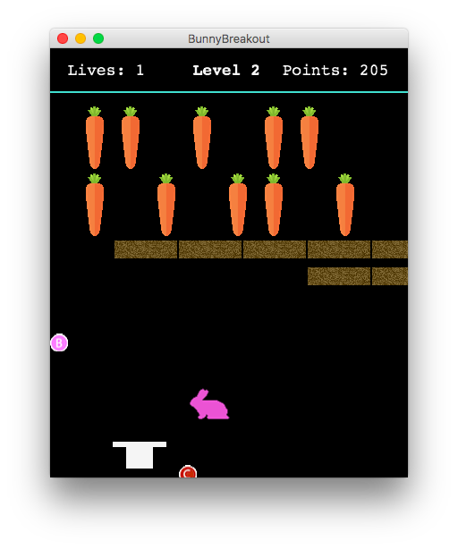
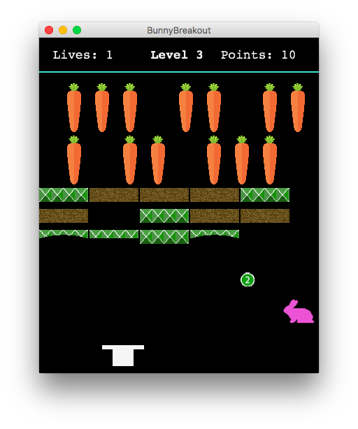

BunnyBreakout
=============
An individual project for Duke's Computer Science 308 (Design and Implementation). For this first project, I individually built a rabbit-themed breakout game.

**File used to start / test the project:** BunnyBreakout.java.
**Data or resource files required by the project:**

 - Level files (text files): 1, 2, and 3. Files are configurations for levels. In these files, the 1 character represents a carrot block, the 2 character represents a soil block, and the 3 character represents a grass block. Whitespace represents space in the level.
 - Images: 1.gif, 2.gif, 3.gif, 2_broken.gif, 3_broken.gif, 3_broken_twice.gif, bunny.gif, power_1.gif, power_2.gif, power_3.gif.
 - Music: song.mp3.

**Key inputs that may be used during the program:**

 - Left and right arrows, to move top hat in the corresponding directions.
 - Space bar: extend top hat the width of the screen.
 - 1, 2, or 3: go to corresponding level.
 - C: remove carrots.
 - S: remove soil.
 - G: remove grass.
